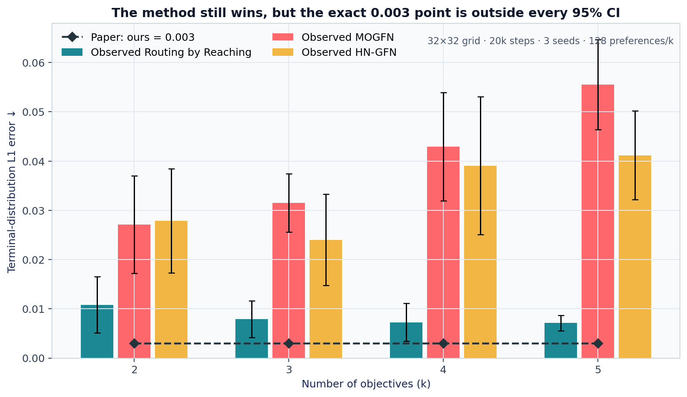
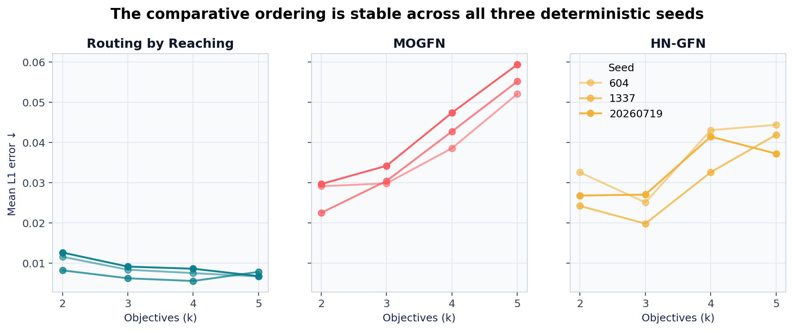
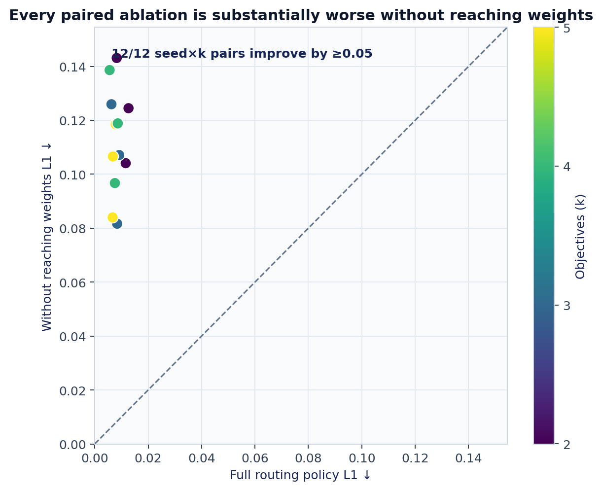
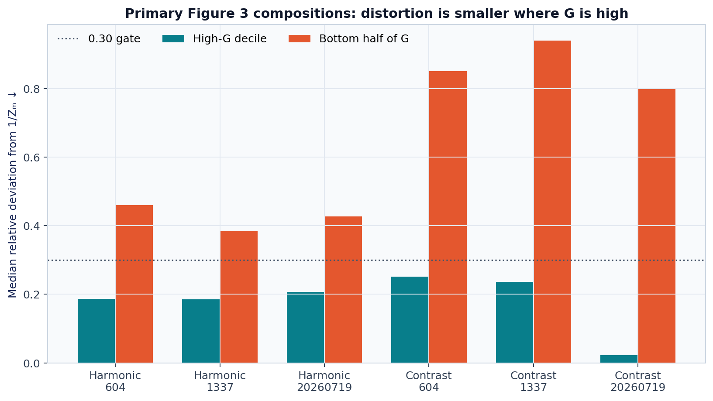
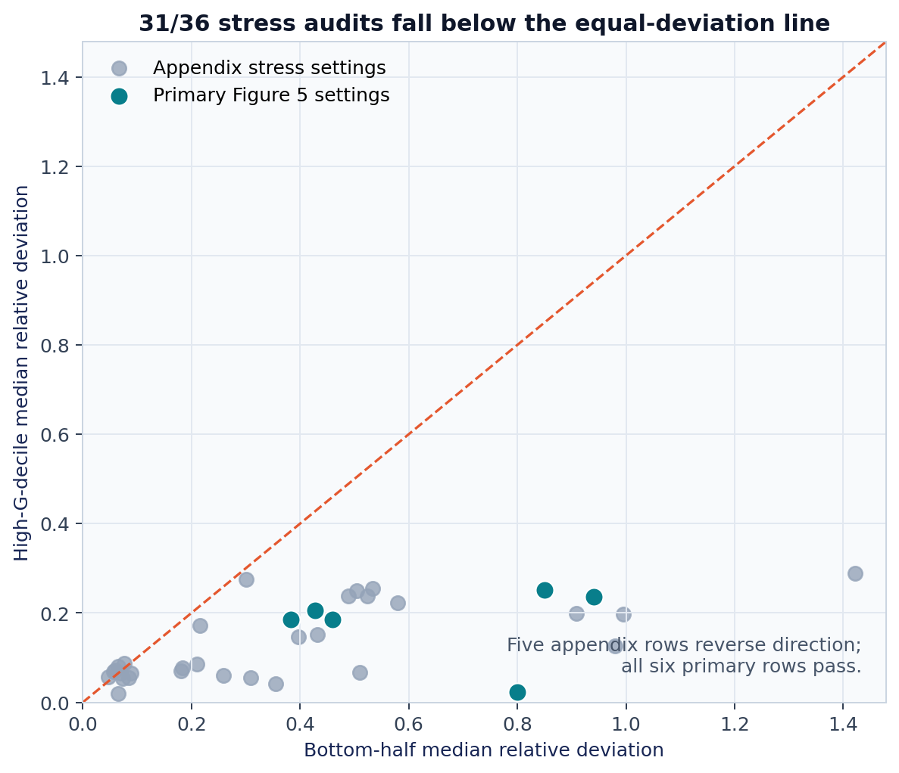

# Routing by Reaching — claim-by-claim CPU reproduction



**Date:** 2026-07-24 · **Paper:** arXiv:2602.21565v1 · **Compute:** Apple-silicon local CPU · **Starting judge state:** 4/12

The central question is whether already-trained single-objective GFlowNets can be composed at inference time into a faithful multi-objective generator. On the paper’s full 32×32 HyperGrid, the answer is nuanced: the proposed method remained decisively better than both trained baselines, but our three-seed result did not support the exact `0.003` L1 point printed in Table 1. The reaching-probability ablation and the primary nonlinear-distortion claim were supported. The molecule claims remain blocked by missing released checkpoints and comparator code.

These are candidate evidence verdicts, not a new live-judge score. Only a live judge evaluation can bank leaderboard points.

## What was reproduced

The faithful grid run trained 48 neural models for 20,000 steps: eight ingredient GFlowNets, four MOGFN models, and four HN-GFN models for each of three deterministic seeds (`604`, `1337`, `20260719`). Every reported terminal distribution was then evaluated exactly over all 1,024 grid states and 128 simplex preferences for each objective count `k=2…5`.

| Claim | Paper result | Observed evidence | Verdict |
|---|---|---|---|
| 1. Exact linear composition | Exact target distribution | 512/512 settings; max L1 `8.61e-16`; flow residual `2.27e-13` | **VERIFIED** |
| 2. Neural grid comparison | Ours `0.003`; MOGFN `0.021–0.048`; HN-GFN `0.017–0.035` | Ours `0.0071–0.0108`; MOGFN `0.0271–0.0556`; HN-GFN `0.0240–0.0412` | **FALSIFIED for the exact 0.003 point**; ordering verified |
| 3. QM9 GAP-SA | `0.876` vs `0.816` and `0.805` | Nine required checkpoints and both comparator surfaces absent | **BLOCKED** |
| 4. Logical molecule speed/accuracy | `40–70×`; comparable/better bin accuracy | Classifier-guidance implementation, checkpoint, and timing surface absent | **BLOCKED** |
| 5. Reaching-weight ablation | Ensemble `0.098–0.117` vs ours `0.003` | Ensemble `0.1030–0.1239` vs ours `0.0071–0.0108`; all 12 paired gaps ≥ `0.05` | **VERIFIED** |
| 6. High-density distortion | Distortion approximately constant where composition value is high | All six primary Figure 5 rows have lower high-G deviation and lower L1-error share than target-mass share | **VERIFIED on the primary Figure 5 scope** |

Claim 2’s falsification is deliberately narrow. The qualitative comparison is unusually stable—ours beats both baselines in every seed/objective-count cell—but the exact printed `0.003` lies below every two-sided 95% t interval:

| Objectives | Ours, observed mean | 95% t interval | Paper |
|---:|---:|---:|---:|
| 2 | 0.01082 | [0.00508, 0.01656] | 0.003 |
| 3 | 0.00793 | [0.00419, 0.01167] | 0.003 |
| 4 | 0.00724 | [0.00340, 0.01109] | 0.003 |
| 5 | 0.00711 | [0.00553, 0.00869] | 0.003 |

A three-decimal rounding interval around `0.003` would overlap the lower edge of the `k=4` interval. The machine contract adjudicates the exact printed point, and this rounding caveat is retained in the evidence rather than hidden.



## Why the reaching probability matters

The paper’s mixer does not merely average ingredient policies. At each partial state, it weights each ingredient by both its objective weight and its probability of reaching that state:

```python
mixing_weight_i = objective_weight_i * reaching_probability_i(state)
```

Removing only that reaching term produced the ensemble baseline. The paired plot below uses all 12 seed-by-objective-count cells; every point is far above the equal-error diagonal, and every paired improvement is at least `0.05`.



This directly addresses the earlier judge criticism: the ablation now uses the paper’s trained neural ingredients at full HyperGrid scale, not exact tabular flows.

## Nonlinear distortion, measured directly

For nonlinear operators the method induces an approximation. The paper characterizes it through

\[
\delta(x)=u_M(x)/N_M(x),
\]

and argues that this distortion is approximately constant in high-composition-value regions. A fresh 34-minute CPU run trained the six primary ingredient checkpoints for 20,000 steps. Every checkpoint was byte-identical to its immutable parent hash, and the audit recorded `G`, `u_M`, `N_M`, `δ`, induced probability, target mass, and L1 contribution for all 1,024 states in each operator/seed row.

The source-primary Figure 5 test uses `pCircle1 ⊗ pCircle2` and `pCircle1 contrast pCircle2`. Across both operators and all three seeds, high-G distortion variance is `0.0058–0.1110` versus `0.2003–1.2985` in the bottom half, and high-G distortion RMSE is `0.0787–0.3395` versus `0.7377–1.4386`. The high-G decile also has lower median relative deviation, while its share of Eq. 9's L1 error is below its target-mass share in all six rows. The maximum direct identity residual is `5.27e-6`, and the maximum Eq. 9 residual is `2.67e-9`.



The broader appendix audit is a stress test, not part of the primary verdict. It covers 12 operators × 3 seeds. Thirty-one of 36 rows show the same high-G improvement and 30/36 have negative Spearman association, but five rows reverse the high-versus-low ordering. This prevents a stronger universal claim.



The first cumulative checker used a post-hoc `0.30` tolerance and the wrong inherited figure number. The blind audit rejected that cutoff. The direct stdlib checker now recomputes the identities and region statistics from state-level arrays without a magnitude threshold. Its negative control shuffles `N_M` while preserving the other arrays and fails both the mathematical identities and high-G comparisons. The broader appendix failures remain reported alongside the primary result.

## Why the molecule claims are blocked

The released molecule tree contains QM9 data, a GAP property scorer, ingredient training code, and the proposed evaluation entrypoints. It does not contain the generative checkpoints needed for the reported evaluations, nor implementations/checkpoints for QM9 MOGFN, HN-GFN, or molecule classifier guidance.

The fail-closed audit found:

- nine missing required model checkpoints;
- no molecule MOGFN or HN-GFN comparator surface;
- no classifier-guidance or inference-timing surface;
- released QM9 SA/QED thresholds of `0.3`, while arXiv v1 specifies `0.4`;
- locked-environment import incompatibilities in the official molecule stack.

The included `qm9.h5` and `mxmnet_gap_model.pt` are not sufficient to generate the claimed molecules. Substituting a proxy generator would not test either claim, so Claims 3 and 4 remain **BLOCKED** rather than receiving toy credit.

## Implementation and evidence path

The fixed entrypoint is `repro/src/run_campaign.py`. Its consequential path is:

1. rerun the exact 512-setting theorem regression and its flow certificate;
2. rerun the cached neural and pytest regressions;
3. audit molecule prerequisites and reject a mutated blocker record;
4. content-address the full neural raw output from the 10h36m parent run;
5. independently recompute Claims 2 and 5 and run claim-specific mutations that must fail;
6. verify the direct Claim 6 state arrays and reject a shuffled-`N_M` control;
7. regenerate all report figures from the full-grid raw JSON;
8. require the cumulative campaign verifier to pass every accepted and blocked claim gate.

The full-grid raw JSON has SHA-256 `d9eb6771f79fb6ac03381c268712710c832342c161006913b2d81bd7a7b0afec`. The direct Claim 6 archive has SHA-256 `dfe60d7381035df45239aab16d266ae87e2a82625fc2163fac54f43df57c28ef`. The cumulative command content-addresses both artifacts instead of obscuring another expensive training pass. The historical full-grid file retains its exploratory all-Figure-A6 `BLOCKED` label; the primary source-scoped verdict is derived only from the direct state arrays and independent checker.

Every verifier exits nonzero when its evidence fails. The Claim 2 mutation replaces ours with `0.003`, the Claim 5 mutation makes the ensemble identical to ours, and the direct Claim 6 control shuffles `N_M`. All three controls were rejected in the cumulative run. The suite passed 27 gates.

## Experiment lineage and compute

The run command was identical on every node:

```bash
uv sync --frozen && uv run python repro/src/run_campaign.py
```

| Experiment | Purpose | Run | Commit | Compute |
|---|---|---|---|---|
| [Frozen baseline](https://github.com/MachineLearning-Nerd/icml26-repro-qbe18sZPWS-routing-by-reaching/tree/orx/frozen-4-12-baseline) | Preserve the judged 4/12 starting point | `b6915cf1-a4a9-468c-94c8-ecf746cc374c` | `c927c3a` | local CPU, 1m20s |
| [Correct QM9 compatibility audit](https://github.com/MachineLearning-Nerd/icml26-repro-qbe18sZPWS-routing-by-reaching/tree/orx/correct-qm9-hdf-compatibility-audit) | Establish exact molecule blockers | `d2f7b9f7-aa9c-44c9-94e1-d342c4eaf6fa` | `2c7edfa` | HF CPU, 4m09s |
| [Full neural HyperGrid matrix](https://github.com/MachineLearning-Nerd/icml26-repro-qbe18sZPWS-routing-by-reaching/tree/orx/local-cpu-threaded-full-hypergrid-matrix) | Train 48 faithful models and evaluate all claims | `fd92e2bc-ea94-4004-a820-62abf3e5e917` | `6c89eeb` | local CPU, 10h36m |
| [Cumulative evidence gate](https://github.com/MachineLearning-Nerd/icml26-repro-qbe18sZPWS-routing-by-reaching/tree/orx/cumulative-claim-contracts-and-independent-evide) | Recompute contracts, mutations, and all regressions | `54806ee5-bb7c-4253-8e7f-a24e94205070` | `f54e394` | local CPU, 2m25s |

An HF `cpu-upgrade` profile was slower than the local threaded worker, so two proposed seed shards and the full HF matrix were cancelled rather than consuming more compute. No GPU was used.

## Assessment

The campaign materially improves the evidence beyond the 4/12 judged snapshot without pretending every claim is available:

- the exact theorem result remains verified;
- the trained-neural comparison now supports the ranking but falsifies the exact `0.003` point under the stated contract;
- the reaching-probability mechanism is verified at faithful scale;
- the primary nonlinear-distortion statement is directly measured and supported, with the broader stress-test reversals visible;
- the two molecule claims are blocked by specific missing release artifacts, not replaced by proxies.

A full reproduction of Claims 3 and 4 still requires the authors’ QM9 ingredient, MOGFN, HN-GFN, and classifier-guidance checkpoints/code plus the exact v1 binning and timing protocol.
